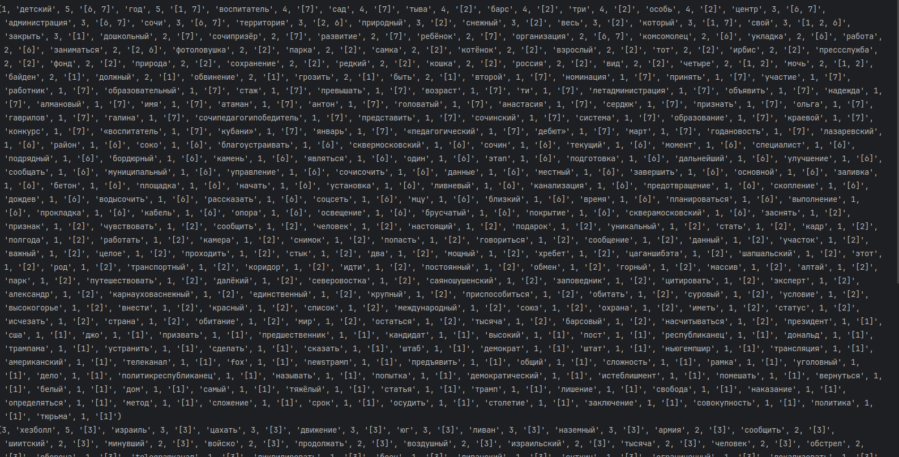

# 🧠 Universal Tag Extractor

Python-скрипт для автоматического извлечения тегов из текстов публикаций. Использует морфологический разбор, чистку и агрегацию. Подходит для аналитики, рекомендаций или облака тегов.
## 🌐 Визуализация тегов

Для проекта настроен веб-интерфейс на виртуальной машине, где можно просмотреть облако тегов в реальном времени.

Пример работы доступен по ссылке:  
http://185.146.1.230/index.php/admin/tag/tag_2
## 🚀 Возможности

- Очистка текста от пунктуации, цифр, ненужных слов
- Морфологическая нормализация (`pymorphy2`)
- Подсчёт частоты тегов
- Сохранение тегов с ID публикаций в базу данных



## Структура базы данных

Проект работает с MySQL и использует три основные таблицы:

---

### `publication`

Хранит тексты публикаций, из которых извлекаются теги.

| Поле      | Тип        | Описание                            |
|-----------|------------|-------------------------------------|
| `id`      | INT (PK)   | Уникальный идентификатор публикации |
| `title`   | TEXT       | Заголовок публикации                |
| `content` | LONGTEXT   | Основной текст публикации           |
| `date`    | DATETIME   | Дата публикации                     |
| `source`  | VARCHAR    | Источник (сайт, автор и т.п.)       |

---

### `publications_in_project`

Связывает публикации с проектами. Один проект может содержать несколько публикаций.

| Поле             | Тип    | Описание                              |
|------------------|--------|---------------------------------------|
| `project_id`     | INT    | ID проекта                            |
| `publication_id` | INT    | ID публикации                         |

> Это таблица «многие ко многим» между проектами и публикациями.

---

### `tags`

Хранит сгенерированные теги для каждого проекта. Теги автоматически извлекаются из публикаций, очищаются и нормализуются.

| Поле            | Тип        | Описание                                              |
|------------------|------------|--------------------------------------------------------|
| `tag_id`         | INT (PK)   | Уникальный идентификатор тега                         |
| `project_id`     | INT        | Проект, к которому относится тег                      |
| `tag`            | VARCHAR    | Слово/тег, извлечённое из текста                      |
| `count`          | INT        | Количество повторений этого тега в рамках проекта     |
| `publication_id` | TEXT       | Список ID публикаций, где встречался этот тег (JSON)  |

> `publication_id` хранится как JSON-массив вида `"[1, 3, 7]"`.

---

### Пример SQL-схемы 

```sql
CREATE TABLE publication (
    id INT AUTO_INCREMENT PRIMARY KEY,
    title TEXT,
    content LONGTEXT,
    date DATETIME,
    source VARCHAR(255)
);

CREATE TABLE publications_in_project (
    project_id INT,
    publication_id INT
);

CREATE TABLE tags (
    tag_id INT AUTO_INCREMENT PRIMARY KEY,
    project_id INT,
    tag VARCHAR(255),
    count INT,
    publication_id TEXT
);

## Установка

```bash
git clone https://github.com/yourusername/universal-tag-extractor.git
cd universal-tag-extractor
python -m venv venv
source venv/bin/activate
pip install -r requirements.txt

## Запуск
python script.py